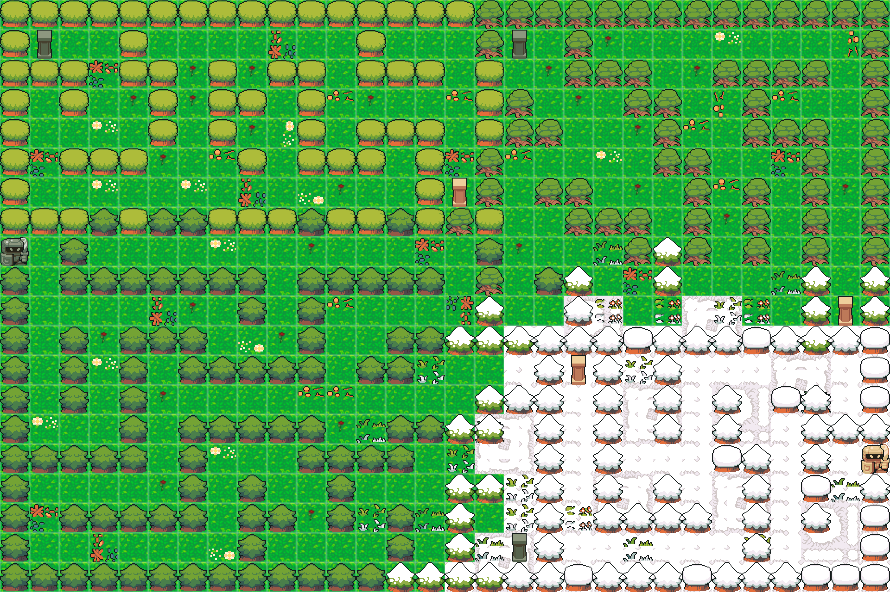

# MazeGame 使用说明

* ## 介绍

  + ### 背景

    你是一个名叫**伊泽瑞尔 (Ezreal) **的探险家, 

    

    现在你正在探索一个**树林迷宫 (Woods Maze) **,

    已知该迷宫分为**四个区域 (AREA) ,**

    有一个**入口 (ENTRY) **和一个**出口 (EXIT) **

    

        &nbsp;
        &nbsp;
        
        &nbsp;
        
    

    

        ENTRY&nbsp;&nbsp;&nbsp;&nbsp;&nbsp;&nbsp;&nbsp;&nbsp;EXIT
    

    玩家可以通过**传送**在区域之间跳转

    

    

        
        
    

    

        TP_IN&nbsp;&nbsp;&nbsp;TP_OUT
    

  + ### 目标

    从迷宫的**入口 (ENTRY) **出发，找到迷宫的**出口 (EXIT) **

* ## 运行流程

  在exe文件夹找到可执行文件(maze.exe)，双击运行即可

* ## 帮助

  + 按 **ESC** 退出游戏

  + 通过 **上 (↑)  下 (↓)  左 (←)  右 (→)**  方向键移动人物

  + 在 **传送区域 (TP_IN)** 内按 **空格 (SPACE)** 即可被传送至 **指定区域(TP_OUT)**

  + 按 **U** 提高bgm音量

  + 按 **D** 降低bgm音量

